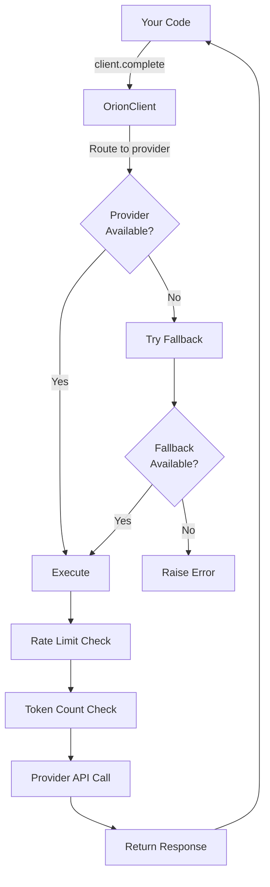

<p align="center">
  
  
  <a href="https://github.com/windyworldair/Orion/blob/main/LICENSE"></a>
  
  <br/><br/>
  
  
  
  
  
</p>

---

## 📑 Table of Contents

- [Why Orion SDK?](#why-orion-sdk)
- [Features](#features)
- [Quick Start](#quick-start)
- [Supported Providers](#supported-providers)
- [Comparison vs Alternatives](#comparison-vs-alternatives)
- [How It Works](#how-it-works)
- [API Reference](#api-reference)
- [Custom Providers](#custom-providers)
- [Examples](#examples)
- [Installation Methods](#installation-methods)
- [FAQ](#faq)
- [Contributing](#contributing)
- [License](#license)

---

## Why Orion SDK?

Every major AI platform ships its own client library. OpenAI has `openai`, Anthropic has `anthropic`, Google has `google-generativeai`. Orion gives you the same thing — but **unified**.

Instead of juggling 5 different SDKs with 5 different APIs, different error formats, and different tool-calling conventions, you get **one package, one interface, one `complete()` call**.

```python
from orion_sdk import OrionClient

client = OrionClient()
client.add_provider("anthropic", api_key="sk-ant-...")
client.add_provider("openai",   api_key="sk-...")

response = client.complete("Hello, world!")
print(response.content)
```

**That's it.** No provider lock-in, no API format memorization, no 300-page docs.

> [!TIP]
> Use provider aliases to save keystrokes — `"claude"` instead of `"anthropic"`, `"gpt"` instead of `"openai"`, `"local"` instead of `"ollama"`. See the full alias list [below](#provider-aliases).

---

## ✨ Features

- **5 providers, one API** — OpenAI, Anthropic, Google, OpenRouter, Ollama
- **Automatic fallback chains** — provider A fails? Try B, then C, automatically
- **Streaming support** — async iterator of chunks for real-time output
- **Tool/function calling** — unified format, auto-converts between provider schemas
- **Rate limiting** — per-provider token bucket with configurable RPM
- **Context window validation** — catches overflow before it hits the API
- **Token counting** — tiktoken when available, smart estimation otherwise
- **Custom providers** — subclass `Provider` and register it
- **Zero lock-in** — swap providers by changing one string, not your codebase
- **Provider aliases** — `"claude"` → `"anthropic"`, `"gpt"` → `"openai"`, `"local"` → `"ollama"`

---

## 🚀 Quick Start

> [!NOTE]
> You only need `pip install orion_sdk` for the core. Provider packages (`openai`, `anthropic`, `google-generativeai`) are optional — install only the ones you actually use.

### Install

```bash
pip install orion_sdk
```

### One-liner

```python
from orion_sdk import create_client

client = create_client("anthropic", api_key="sk-ant-...")
response = client.complete("What is 2 + 2?")
print(response.content)  # "4"
```

> [!IMPORTANT]
> Never hardcode API keys in your code. Use environment variables — Orion SDK automatically picks up `OPENAI_API_KEY`, `ANTHROPIC_API_KEY`, `GEMINI_API_KEY`, and `OPENROUTER_API_KEY` from your environment.

### Multi-provider with fallback

```python
from orion_sdk import OrionClient

client = OrionClient()
client.add_provider("anthropic", api_key="sk-ant-...")
client.add_provider("openai",   api_key="sk-...")
client.add_provider("google",   api_key="...")

# Try Anthropic → OpenAI → Google automatically
client.set_fallback_chain("anthropic", "openai", "google")

response = client.complete("Write a Python HTTP server")
print(response.content)
print(response.model)       # "claude-sonnet-4-20250514"
print(response.provider)    # "anthropic"
print(response.usage)       # {"prompt_tokens": 42, "completion_tokens": 187}
```

### Streaming

```python
from orion_sdk import OrionClient

client = OrionClient()
client.add_provider("openai", api_key="sk-...", set_default=True)

for chunk in client.stream("Tell me a story"):
    print(chunk.content, end="", flush=True)
```

### Tool calling

```python
from orion_sdk import OrionClient, ToolDefinition

client = OrionClient()
client.add_provider("anthropic", api_key="sk-ant-...")

tools = [
    ToolDefinition(
        name="get_weather",
        description="Get the current weather for a city",
        parameters={
            "type": "object",
            "properties": {
                "city": {"type": "string", "description": "City name"},
                "unit": {"type": "string", "enum": ["celsius", "fahrenheit"]}
            },
            "required": ["city"]
        }
    )
]

response = client.complete("What's the weather in Tokyo?", tools=tools)

if response.has_tool_calls:
    for call in response.tool_calls:
        print(f"Call: {call.name}({call.arguments})")
        # {"city": "Tokyo", "unit": "celsius"}
```

---

## 📊 Supported Providers

| Provider | Package | Models | API Key |
|----------|---------|--------|---------|
| **OpenAI** | `openai` | GPT-4o, o1, o3, GPT-4o-mini, GPT-4-turbo | `OPENAI_API_KEY` |
| **Anthropic** | `anthropic` | Claude Opus 4, Claude Sonnet 4, Claude 3.5, Claude 3 | `ANTHROPIC_API_KEY` |
| **Google** | `google-generativeai` | Gemini 2.5 Pro, Gemini 2.5 Flash, Gemini 2.0, Gemini 1.5 | `GEMINI_API_KEY` |
| **OpenRouter** | `openai` | 21+ models (Claude, GPT, Gemini, Grok, Llama, DeepSeek, Qwen...) | `OPENROUTER_API_KEY` |
| **Ollama** | `requests` | Llama 3.3, Mistral, Qwen 2.5, CodeLlama, Phi3, Gemma2... | *None — fully local* |

### Provider Aliases

```python
# These all work
client.add_provider("claude",   ...)  # → anthropic
client.add_provider("gpt",     ...)  # → openai
client.add_provider("gemini",  ...)  # → google
client.add_provider("local",   ...)  # → ollama
```

> [!TIP]
> Aliases also work in `complete()` and `stream()` — just pass `model="claude-opus-4"` and Orion resolves the provider automatically.

---

## ⚔️ Comparison vs Alternatives

| Feature | **Orion SDK** | OpenAI SDK | Anthropic SDK | LiteLLM |
|---------|---|---|---|---|
| Multi-provider support | ✅ (5) | ❌ | ❌ | ✅ (20+) |
| Fallback chains | ✅ Built-in | ❌ | ❌ | ⚠️ Complex |
| Unified API | ✅ One method | ❌ | ❌ | ✅ |
| Token counting | ✅ Automatic | ✅ Manual | ✅ Manual | ⚠️ Limited |
| Context validation | ✅ Pre-check | ❌ | ❌ | ❌ |
| Rate limiting | ✅ Per-provider | ❌ | ❌ | ⚠️ Basic |
| Custom providers | ✅ Easy | ❌ | ❌ | ✅ |
| Streaming | ✅ Async | ✅ | ✅ | ✅ |
| Tool calling | ✅ Unified | ✅ Native | ✅ Native | ✅ Unified |
| Local models | ✅ Ollama | ❌ | ❌ | ✅ |

**Key Differences:**
- **vs LiteLLM**: Smaller API surface, automatic fallbacks, tighter integration
- **vs Individual SDKs**: One unified interface, no code changes to swap providers

---

## 🏗️ How It Works



**Flow:**
1. Define providers + fallback chain
2. Call `client.complete(prompt)`
3. SDK validates context window & token count
4. Sends to primary provider
5. If fails → auto-retry with fallback provider
6. Returns unified `Response` object

---

## 📚 API Reference

### `OrionClient`

```python
client = OrionClient(config={
    "default_provider": "anthropic",
    "default_model": "claude-sonnet-4-20250514",
    "timeout": 120.0,
    "max_retries": 3,
    "rate_limits": {"anthropic": 60, "openai": 120}
})
```

| Method | Description |
|--------|-------------|
| `add_provider(name, api_key, ...)` | Register a provider |
| `remove_provider(name)` | Remove a registered provider |
| `set_fallback_chain(*providers)` | Set failover priority |
| `complete(prompt, ...)` | Synchronous completion |
| `stream(prompt, ...)` | Streaming completion (async iterator) |
| `count_tokens(text, model)` | Count tokens |
| `count_messages_tokens(messages, model)` | Count tokens for a message list |
| `get_context_limit(model)` | Get model's context window size |
| `list_providers()` | List registered providers |
| `list_models(provider)` | List available models |
| `register_custom_provider(name, cls)` | Register a custom provider class |

### Data Types

```python
# Message
msg = Message.user("Hello!")
msg = Message.system("You are helpful.")
msg.to_dict()  # {"role": "user", "content": "Hello!"}

# Response
response.content        # str
response.tool_calls     # list[ToolCall]
response.model          # str
response.provider       # str
response.usage          # {"prompt_tokens": ..., "completion_tokens": ...}
response.has_tool_calls # bool

# StreamChunk
chunk.content        # str
chunk.finish_reason  # str | None
chunk.model          # str

# ToolDefinition — auto-converts to provider formats
tool.to_openai()       # OpenAI schema
tool.to_anthropic()    # Anthropic schema
tool.to_gemini_tools() # Gemini schema
```

### Exceptions

```python
from orion_sdk import (
    OrionError,                # Base exception
    ProviderError,             # Error from a specific provider
    ProviderNotFoundError,     # Provider not registered
    AuthenticationError,       # Invalid API key
    RateLimitError,            # Rate limit hit
    ContextOverflowError,      # Input exceeds context window
    AllProvidersFailedError,   # All fallback providers failed
    TimeoutError,              # Request timed out
    InvalidConfigError,        # Bad configuration
)

try:
    response = client.complete(prompt)
except ContextOverflowError as e:
    print(f"Too many tokens: {e.tokens} > {e.limit}")
except AllProvidersFailedError as e:
    print(f"All failed:\n{e.errors}")
```

### Rate Limiting

```python
from orion_sdk import OrionClient

client = OrionClient()
client.add_provider("anthropic", api_key="sk-ant-...")
client.add_provider("openai",   api_key="sk-...")

# Built-in rate limiter (default 60 req/min per provider)
# Or configure at init:
client = OrionClient(config={
    "rate_limits": {"anthropic": 50, "openai": 100}
})
```

---

## 🧩 Custom Providers

```python
from orion_sdk import OrionClient, Provider, ProviderConfig, Response, Message
from orion_sdk.providers.base import StreamChunk

class MyCustomProvider(Provider):
    NAME = "custom"
    MODELS = {"custom-model-v1": {"context": 32000, "output": 4096}}

    def __init__(self, config: ProviderConfig):
        super().__init__(config)
        # Your client setup here

    def complete(self, messages, model="", tools=None, temperature=0.7, max_tokens=4096, **kwargs):
        model = self.validate_model(model)
        # Your API call here
        return Response(content="...", model=model, provider=self.NAME)

    def stream(self, messages, model="", tools=None, temperature=0.7, max_tokens=4096, **kwargs):
        model = self.validate_model(model)
        # Your streaming implementation here
        yield StreamChunk(content="...", model=model, provider=self.NAME)

    def list_models(self):
        return [{"id": m, "name": m, **info} for m, info in self.MODELS.items()]

# Register and use
client = OrionClient()
client.register_custom_provider("custom", MyCustomProvider)
client.add_provider("custom", api_key="...", set_default=True)
response = client.complete("Hello!")
```

---

## 📂 Architecture

```
orion_sdk/
├── __init__.py              # Public API — everything re-exported here
├── client.py                # OrionClient — the unified interface
├── exceptions.py            # 9 typed exceptions
├── ratelimit.py             # Token bucket rate limiter (thread-safe)
├── tokens.py                # Token counting + context window registry
└── providers/
    ├── __init__.py          # Provider registry + aliases
    ├── base.py              # Abstract Provider + Message/Tool/Response types
    ├── openai.py            # OpenAI GPT (also base for OpenAI-compatible)
    ├── anthropic.py         # Anthropic Claude
    ├── google.py            # Google Gemini
    ├── openrouter.py        # OpenRouter (extends OpenAI provider)
    └── ollama.py            # Ollama local models (no API key)
```

Each provider implements three methods: `complete()`, `stream()`, and `list_models()`. `OrionClient` wraps them with fallback logic, rate limiting, and token management.

---

## 📍 Context Window Limits

Built-in registry for 30+ models. Checked automatically before sending:

```python
client.get_context_limit("claude-opus-4-20250514")  # 200,000
client.get_context_limit("gpt-4o")                   # 128,000
client.get_context_limit("gemini-1.5-pro")           # 2,097,152
```

Raises `ContextOverflowError` if you exceed the limit — so you never waste tokens on a call that'll fail.

> [!WARNING]
> Context limits are checked **before** the API call. If your input exceeds the window, Orion raises immediately — no tokens wasted, no unexpected charges.

---

## 📦 Installation Methods

### PyPI (Recommended)

```bash
# Core (only requires Python stdlib)
pip install orion_sdk

# With provider packages
pip install orion_sdk openai anthropic google-generativeai requests

# With token counting (for accuracy)
pip install orion_sdk tiktoken
```

### From Source

```bash
git clone https://github.com/windyworldair/Orion.git
cd Orion
pip install -e .
```

> [!NOTE]
> Install `tiktoken` for accurate token counting. Without it, Orion falls back to character-based estimation (~4 chars per token) — good enough, but not exact.

---

## 💡 Examples

<details>
<summary><b>Example 1: Retry Failed Provider</b></summary>

```python
from orion_sdk import OrionClient

client = OrionClient()
client.add_provider("anthropic", api_key="sk-ant-...")
client.add_provider("openai", api_key="sk-...")

# If Anthropic is down, automatically use OpenAI
client.set_fallback_chain("anthropic", "openai")

response = client.complete("Explain quantum computing in 50 words")
print(f"Response from {response.provider}: {response.content}")
```

</details>

<details>
<summary><b>Example 2: Real-time Streaming</b></summary>

```python
from orion_sdk import OrionClient

client = OrionClient()
client.add_provider("openai", api_key="sk-...")

print("Streaming response: ", end="", flush=True)
for chunk in client.stream("Write a 3-line poem"):
    print(chunk.content, end="", flush=True)
```

</details>

<details>
<summary><b>Example 3: Token Counting Before API Call</b></summary>

```python
from orion_sdk import OrionClient

client = OrionClient()
client.add_provider("anthropic", api_key="sk-ant-...")

prompt = "Explain AI " * 10000  # Very long prompt
tokens = client.count_tokens(prompt, model="claude-opus-4")
print(f"Prompt uses {tokens} tokens")

# Check if it fits in context
limit = client.get_context_limit("claude-opus-4")
if tokens > limit:
    print(f"Error: {tokens} exceeds limit of {limit}")
else:
    response = client.complete(prompt)
```

</details>

<details>
<summary><b>Example 4: Multi-Provider Comparison</b></summary>

```python
from orion_sdk import OrionClient

client = OrionClient()
client.add_provider("anthropic", api_key="sk-ant-...")
client.add_provider("openai", api_key="sk-...")
client.add_provider("google", api_key="...")

providers = ["anthropic", "openai", "google"]

for provider in providers:
    response = client.complete(
        "Why is the sky blue?",
        model=provider,
    )
    print(f"{response.provider}: {response.content}\n")
```

</details>

---

## ❓ FAQ

<details>
<summary><b>Q: What happens if all fallback providers fail?</b></summary>

A: Orion raises `AllProvidersFailedError` with details on each failure:

```python
from orion_sdk import AllProvidersFailedError

try:
    response = client.complete("Hello")
except AllProvidersFailedError as e:
    for provider, error in e.errors.items():
        print(f"{provider}: {error}")
```

</details>

<details>
<summary><b>Q: Can I use Orion offline?</b></summary>

A: Yes! Use Ollama for fully local inference:

```python
client.add_provider("ollama", base_url="http://localhost:11434")
# No API key needed
```

</details>

<details>
<summary><b>Q: Does Orion work with async?</b></summary>

A: Streaming is async-compatible. Full async support coming soon in v2.0.

</details>

<details>
<summary><b>Q: Where's Orion the AI agent?</b></summary>

A: Orion (the AI agent) is a separate, closed-source project. This SDK is the open-source unified interface for talking to LLM providers — it's what powers Orion under the hood, and now you can use it too!

</details>

<details>
<summary><b>Q: How does rate limiting work?</b></summary>

A: Per-provider token bucket. Default 60 requests/min. Configurable at init:

```python
client = OrionClient(config={
    "rate_limits": {"anthropic": 30, "openai": 100}
})
```

</details>

---

## 🤝 Contributing

We welcome contributions! Here's how:

1. **Fork** the repository
2. **Create** a feature branch (`git checkout -b feature/amazing-feature`)
3. **Commit** your changes (`git commit -m 'Add amazing feature'`)
4. **Push** to branch (`git push origin feature/amazing-feature`)
5. **Open** a Pull Request

### Development Setup

```bash
git clone https://github.com/windyworldair/Orion.git
cd Orion
pip install -e ".[dev]"
pytest
```

### Areas We Need Help With

- ✅ Tests and CI/CD setup
- ✅ Documentation improvements
- ✅ New provider integrations
- ✅ Performance optimizations
- ✅ Bug reports and fixes

---

## 📄 License

MIT License — see [LICENSE](./LICENSE) file for details.

---

## 🙏 Support & Community

Have questions?
- 💬 Open an [Issue](https://github.com/windyworldair/Orion/issues)
- 📧 Email: windyworldair@example.com
- ⭐ Leave a star if you find this useful!

---

<p align="center">
  Built with ❤️ by <a href="https://github.com/windyworldair">Windyworld</a>
</p>
